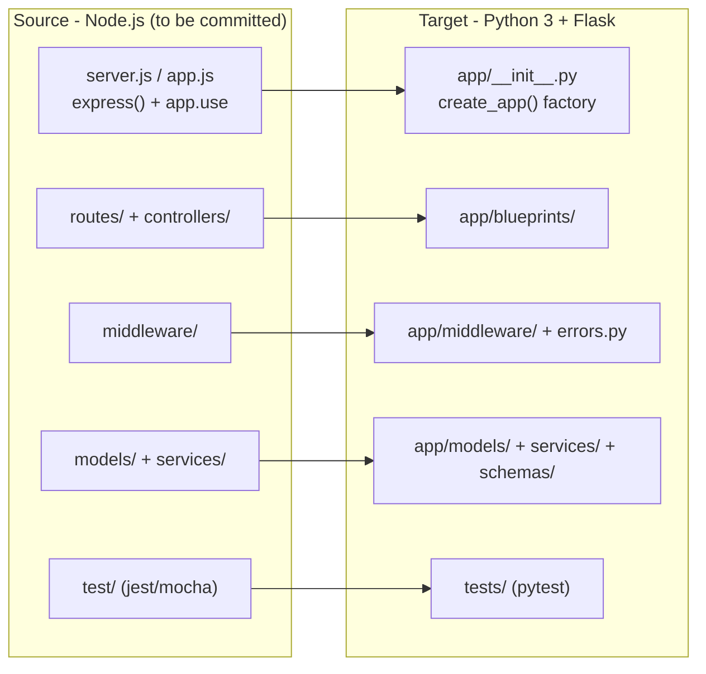

# Technical Specification

# 0. Agent Action Plan

## 0.1 Intent Clarification

This section restates the user's request in precise technical language, surfaces the implicit requirements, and records the single most important constraint discovered during analysis: the source project to be migrated is not present in the repository as committed. The intent itself is unambiguous; what is missing is the source artifact it operates on. Accordingly, this Agent Action Plan captures the migration intent exactly and defines a **conditional transformation framework** that becomes directly executable the moment the Node.js source is committed.

### 0.1.1 Core Refactoring Objective

The user's request is preserved verbatim:

> User Prompt (exact): "Can you rewrite this node.js server in python 3 using flask, preserving all functionalities of the original project?"

Based on the prompt, the Blitzy platform understands that the refactoring objective is to **perform a complete technology-stack migration of an existing Node.js HTTP server into a behaviorally-equivalent Python 3 application built on the Flask web framework, reproducing 100% of the original server's externally observable functionality.** This is a behavior-preserving rewrite — not a redesign, a feature addition, or a performance project.

- **Refactoring type:** Tech stack migration — simultaneously cross-language (JavaScript → Python 3) and cross-framework (Node.js/Express-style HTTP server → Flask). It is not an in-place structural refactor and not a performance-only optimization.
- **Target repository:** Same repository — an in-repo migration that produces Python/Flask target files alongside (and ultimately replacing) the Node.js source. No new-repository directive was provided.
- **Governing constraint:** "preserving all functionalities of the original project" — strict functional parity is the non-negotiable success criterion.

The objective decomposes into the following enumerated goals, each stated with enhanced clarity so that no requirement is left implicit:

| Goal | Description |
|------|-------------|
| G1 | Port every HTTP route (path + method) with identical request/response contracts (status codes, payload shapes, headers). |
| G2 | Reproduce the middleware pipeline semantics — authentication, body parsing, CORS, logging, error handling, and rate limiting where present. |
| G3 | Replicate configuration and environment-variable handling (e.g., `dotenv` → `python-dotenv`/`os.environ`), preserving every variable name and default. |
| G4 | Port the persistence / data-access layer and any ORM or driver usage to a Python equivalent, preserving schema, queries, and relationships. |
| G5 | Port external service integrations (HTTP clients, SDKs, message brokers) to Python equivalents with identical contracts. |
| G6 | Port scheduled jobs, background workers, and websockets if present in the source. |
| G7 | Port authentication and authorization with identical token/session semantics. |
| G8 | Port the test suite to `pytest`, preserving coverage intent and assertions. |
| G9 | Reproduce server bootstrap and listen behavior (host/port, graceful shutdown) under a production WSGI server. |

**Implicit requirements surfaced (not stated by the user but necessary for "preserving all functionalities"):**

- Strict API compatibility — identical URL paths, HTTP methods, status codes, JSON response shapes, and headers.
- Behavior preservation — no new endpoints, no removed endpoints, no altered validation rules or error messages.
- Error-response parity — matching status codes and error body structure for failure paths (404/405/422/500, etc.).
- Logging parity where externally observable (formats and levels consumed by downstream tooling).
- Dependency-equivalent selection — every npm package replaced by a functionally equivalent PyPI package (detailed in §0.5).
- Identical configuration defaults and validation behavior.

### 0.1.2 Technical Interpretation

This refactoring translates to the following technical transformation strategy: the source's Node/Express-style constructs are mapped onto idiomatic Flask using the **Application Factory** pattern, **Blueprints** for route grouping, Flask **extensions** for dependency injection and cross-cutting concerns, centralized error handlers, environment-specific configuration classes, and a production **WSGI** server. The current-to-target architecture mapping is as follows:

| Node.js / Express construct | Flask target | Transformation rule |
|------------------------------|--------------|---------------------|
| `express()` application instance | `create_app()` application factory in `app/__init__.py` | Convert the implicit singleton app + `app.use(...)` wiring into a factory that registers extensions, blueprints, and error handlers. |
| `express.Router()` | `Blueprint(...)` | One blueprint per route group; register via `app.register_blueprint(bp)`. |
| `app.use(mw)` | `@app.before_request` / `@app.after_request` hooks, WSGI middleware, route decorators | Preserve registration order and short-circuit semantics. |
| `req` / `res` | `flask.request` / `make_response` / `jsonify` | `res.status(n).json(x)` → `(jsonify(x), n)`; `res.send(t)` → `return t`. |
| Route param `/users/:id` | `/users/<id>` (or `<int:id>`) | Use a typed converter where the source parsed numerics. |
| `express.json()` body parsing | `request.get_json()` | Parsed on demand rather than via mounted middleware. |
| `next(err)` error propagation | raised exceptions + `@app.errorhandler` | Centralize error mapping; preserve status/body. |
| `async/await` handlers | synchronous WSGI view functions | Default to synchronous; flag `async` views / Quart only for genuinely async-heavy or streaming/websocket workloads. |
| `process.env.X` | `os.environ['X']` surfaced through `Config` classes | Preserve every variable name and default. |
| `server.listen(port)` | `gunicorn 'wsgi:app'` | Production WSGI server replaces the built-in Node HTTP listener. |



### 0.1.3 Critical Clarification — Source Artifact Not Present in Repository

The single most important finding of this analysis is that **the Node.js server the user asks to "rewrite" does not exist in the repository as committed.** Authoritative repository inspection establishes that the repository, identified as "Artifact3," contains exactly one tracked file — `README.md`, whose entire content is the single heading `# Artifact3` [README.md:L1]. There is no Node.js entry point, no `package.json` or lockfile, no JavaScript/TypeScript source, no configuration, and no test suite.

This is corroborated by the Technical Specification: the repository is a pre-implementation baseline at initial commit on the `main` branch [Technical Specification §1.1.2], and is explicitly characterized as a **greenfield repository** with "no incumbent system being replaced, modernized, or augmented" [Technical Specification §1.2.1]. No programming language, framework, runtime, or persistence technology has been selected in committed artifacts [Technical Specification §1.2.2], and the scope is documented as "empty by evidence" [Technical Specification §1.3.1].

- **This is the #1 blocking clarification.** The migration intent is fully captured, but the concrete, per-file transformation cannot reference real source files until the Node.js project is delivered. Fabricating those files would violate the Evidence-Based Authoring Principle that governs this specification [Technical Specification §2.1.2].
- **Resolution adopted by this plan:** capture intent with full technical precision, flag the absent source explicitly, and produce a **conditional transformation framework** (target architecture in §0.3, file mapping in §0.4, dependencies in §0.5, semantic rules in §0.6) that activates automatically once the source is committed.
- **Mapping to re-authoring triggers:** committing the Node.js source corresponds exactly to the documented trigger "first commit introducing source code files / a dependency manifest," which re-populates scope and component sections [Technical Specification §1.3.3, Technical Specification §2.7.1]. At that point, every wildcard pattern in §0.4 resolves to concrete paths.
- **Alignment note (non-normative):** the user's chosen target stack is consistent with the specification's forward guidance, which already lists **Python** as the candidate backend language and **Flask** as the candidate backend framework (both marked "Not committed") [Technical Specification §3.9.3]. This alignment carries no normative force until a commit introduces an artifact, but it confirms the target selection is sound.


## 0.2 Scope Boundaries

This section draws crisp boundaries around the migration. Because the repository is empty-by-evidence [README.md:L1, Technical Specification §1.3.1], the in-scope source patterns are **conditional**: they enumerate the Node.js artifacts that become in scope the instant the source is committed. The target (Flask) patterns enumerate the files this migration will **create**. All patterns use trailing wildcards only.

### 0.2.1 Exhaustively In Scope

**Source transformations (read and port — conditional on delivery of the Node.js source):**

- `**/*.js`, `**/*.cjs`, `**/*.mjs`, `**/*.ts` — all JavaScript/TypeScript server modules: entry point, routers, controllers, middleware, models, services, and utilities.
- `package.json`, `package-lock.json`, `yarn.lock`, `pnpm-lock.yaml` — dependency manifests and lockfiles, mapped to Python equivalents (§0.5).
- `.env`, `.env.*`, `config/**/*` — configuration and environment-variable handling.
- `views/**/*`, `templates/**/*` — server-rendered templates (ported to Jinja2 only if server-side rendering exists).
- `public/**/*`, `static/**/*` — static assets served by the application.
- `test/**/*`, `tests/**/*`, `**/*.test.js`, `**/*.spec.js`, `__tests__/**/*` — test suites, ported to `pytest`.
- `openapi/**/*`, `swagger*.json`, `swagger*.yaml` — API contracts to honor as the parity oracle.

**Target files to create (Python / Flask):**

- `app/__init__.py` (application factory), `config.py`, `wsgi.py` (bootstrap / WSGI entry point).
- `app/blueprints/**/*.py` (routes), `app/models/**/*.py`, `app/services/**/*.py`, `app/schemas/**/*.py`, `app/middleware/**/*.py`, `app/utils/**/*.py`, `app/extensions.py`, `app/errors.py`.
- `requirements.txt`, `requirements-dev.txt`, and/or `pyproject.toml` (dependency manifests), `.env.example`, `.gitignore`.
- `tests/**/*.py` (pytest suite), `tests/conftest.py`.

**Documentation updates:**

- `README.md` — UPDATE from the current `# Artifact3` stub [README.md:L1] to document Python/Flask setup, environment variables, run commands, and test instructions.
- `docs/**/*.md` — update any references to reflect the Python/Flask structure.

**Import corrections:**

- Every target Python file containing internal imports must use absolute package imports (`from app.<package> import <symbol>`), and every ported test must import the Flask app/fixtures rather than the Node modules.

**Configuration, build, and CI updates (mirror only if present in the source):**

- `Dockerfile`, `docker-compose.yml` — ported to a Python base image and `gunicorn` start command.
- `.github/workflows/*.yml`, `.gitlab-ci.yml` — ported from `setup-node` + `npm test` to `setup-python` + `pytest`.

**Rule-mandated files:** none. The user specified no implementation rules (the rules set is empty), so there are no additional files forced into scope by coding guidelines, migration-script requirements, or fixture mandates.

### 0.2.2 Explicitly Out of Scope

The user requested no exclusions explicitly, but the directive "preserving all functionalities" implicitly fixes the following firm out-of-scope boundaries:

- **Any behavioral change** — new features, bug fixes, performance tuning, or API redesign beyond a faithful 1:1 functional port. The migration must not alter observable behavior.
- **New infrastructure or cloud provisioning** — IaC, deployment topology, or managed services not already present in the Node.js source.
- **Database schema migrations or redesign** — the schema is preserved as-is; only the data-access layer is ported.
- **Frontend / client applications** — any client not part of the Node.js server itself.
- **The Blitzy agent's own `/app` source code** — never inspected, referenced, or documented as the project.
- **Re-architecting unrelated to the language/framework migration** — structural changes beyond what is required to express the same behavior idiomatically in Flask.


## 0.3 Target Design

This section defines the target Python/Flask structure the migration will produce, the design patterns applied, and the version-verified technology baseline. The structure is idiomatic Flask built around the Application Factory pattern so that configuration, extensions, and routes are wired in one composable place and the app is trivially testable.

### 0.3.1 Refactored Structure Planning

The target is a standalone, runnable Flask application. The layout below is comprehensive: every file and folder needed for the application to start, serve requests, persist data, and be tested is listed. Annotations indicate the Node.js role each target derives from. Folders marked *(conditional)* are produced only when the source exhibits the corresponding capability.

```
Target:
<repo-root>/
├── README.md                  (UPDATE — Python/Flask setup, env, run, test docs)
├── requirements.txt           (CREATE — pinned runtime dependencies)
├── requirements-dev.txt       (CREATE — test/lint dependencies)
├── pyproject.toml             (CREATE — packaging + tool config; optional alt to requirements)
├── .env.example               (CREATE — documents env var names; mirrors source .env)
├── .gitignore                 (CREATE — venv/, __pycache__/, .pytest_cache/, *.pyc)
├── wsgi.py                    (CREATE — WSGI entry: app = create_app())
├── config.py                  (CREATE — Config classes: Base/Development/Production/Testing)
├── app/
│   ├── __init__.py            (CREATE — create_app() factory; registers extensions, blueprints, errors)
│   ├── extensions.py          (CREATE — db, cors, jwt, ma singletons initialized in factory)
│   ├── blueprints/            (CREATE — one module per Express Router / route group)
│   │   ├── __init__.py
│   │   └── <resource>.py      (CREATE — routes + view functions from routes/ + controllers/)
│   ├── models/                (CREATE — data models from models/)
│   │   ├── __init__.py
│   │   └── <model>.py
│   ├── schemas/               (CREATE — request/response validation & serialization)
│   │   └── <schema>.py
│   ├── services/              (CREATE — business logic from services/)
│   │   └── <service>.py
│   ├── middleware/            (CREATE — before/after_request hooks + auth decorators)
│   │   └── <middleware>.py
│   ├── errors.py              (CREATE — centralized @app.errorhandler registrations)
│   ├── utils/                 (CREATE — helpers from utils/)
│   │   └── <helper>.py
│   ├── templates/             (CREATE, conditional — Jinja2 templates from views/)
│   └── static/                (CREATE, conditional — assets from public/)
├── tests/                     (CREATE — pytest suite from test/)
│   ├── __init__.py
│   ├── conftest.py            (CREATE — app/client/db fixtures)
│   └── test_<resource>.py
├── Dockerfile                 (CREATE, conditional — only if source has Docker)
├── docker-compose.yml         (CREATE, conditional — only if present in source)
└── .github/workflows/ci.yml   (CREATE/UPDATE, conditional — only if source has CI)
```

### 0.3.2 Web Search Research Conducted

To avoid placeholder versions, the target technology baseline was verified against authoritative sources (PyPI, python.org, and project documentation) in May 2026. The verified, citable versions are:

| Technology | Verified version | Note |
|------------|------------------|------|
| Flask | 3.1.3 (released 2026-02-19) | Latest stable; requires Python >= 3.9. |
| Werkzeug | >= 3.1 | Flask 3.1's documented minimum WSGI core dependency. |
| Jinja2 | 3.1.x | Flask templating engine. |
| Python (runtime) | 3.13.x recommended | Mature maintenance branch with broadest extension/wheel coverage; 3.14.5 is the newest feature series (released 2026-05-10). |
| gunicorn | 26.0.0 (released 2026-05-05) | Production WSGI server (UNIX); requires Python >= 3.10. On Windows, use `waitress`. |
| SQLAlchemy | 2.0.50 (released 2026-05-24) | Conditional — only if the source uses a relational database. |

Research themes that informed the design:

- **Best practices for the Node-to-Flask tech-stack migration pattern** — favor the Application Factory + Blueprints layout for testability and modular registration.
- **Python/Flask conventions for project structure** — package the app under `app/`, separate routes, models, services, and schemas; keep configuration in environment-specific classes.
- **Migration strategy for the Node event loop → WSGI model** — default to synchronous views with multi-worker `gunicorn`; externalize any in-process shared state (detailed in §0.6).
- **Safe-refactoring technique** — port and run the test suite under `pytest` as the parity oracle, with per-endpoint contract verification.

### 0.3.3 Design Pattern Applications

- **Application Factory (`create_app()`)** — replaces the implicit Express `app` singleton; enables isolated configuration and clean test setup.
- **Blueprints** — the Flask equivalent of `express.Router()`; group routes by resource and register them in the factory.
- **Service layer** — business logic extracted into `app/services/`, mirroring the source's controller/service separation and keeping view functions thin.
- **Repository / data-access via ORM models** — `app/models/` abstracts persistence (SQLAlchemy for relational sources; `pymongo`/MongoEngine for MongoDB sources), preserving the source schema.
- **Schema / serialization layer** — `app/schemas/` provides request validation and response serialization (marshmallow or pydantic), the equivalent of Joi/`express-validator`.
- **Dependency injection via extensions** — shared resources (database, CORS, JWT, serialization) are instantiated in `app/extensions.py` and bound to the app inside the factory and request/app context.
- **Centralized error handling** — `app/errors.py` registers `@app.errorhandler` functions, replacing Express's `(err, req, res, next)` error middleware while preserving status codes and JSON error bodies.
- **Environment-specific configuration classes** — `config.py` exposes `Base`/`Development`/`Production`/`Testing` configurations sourced from `os.environ`, replacing `dotenv`-driven configuration.
- **Production WSGI serving** — `gunicorn` (or `waitress` on Windows) replaces `server.listen(...)`.

### 0.3.4 User Interface Design

Not applicable. The migration targets a headless HTTP/API server; there is no client-side user interface, component library, or design system in scope. Any server-rendered templates discovered in the source (`views/**/*`) are ported to Jinja2 as a one-to-one functional equivalent rather than redesigned. No Figma frames or design-system assets were provided.


## 0.4 Transformation Mapping

This section provides the exhaustive source-to-target file mapping. Because the repository is empty-by-evidence [README.md:L1, Technical Specification §1.3.1], every "Source File" entry is the canonical Node/Express role or pattern that resolves to a concrete path the moment the Node.js source is committed — at which point this mapping is directly executable. The only mapping that applies to a file already present is `README.md`.

### 0.4.1 File-by-File Transformation Plan

Transformation modes: **UPDATE** (modify an existing file), **CREATE** (produce a new file), **REFERENCE** (use as a pattern exemplar).

| Target File | Transformation | Source File | Key Changes |
|-------------|----------------|-------------|-------------|
| `README.md` | UPDATE | `README.md` | Replace the `# Artifact3` stub [README.md:L1] with Python/Flask setup, env vars, run (`gunicorn`), and test docs. |
| `wsgi.py` | CREATE | `server.js` / `app.js` / `index.js` / `bin/www` | Bootstrap → WSGI entry `app = create_app()`; `http.createServer`/`listen` → `gunicorn`. |
| `app/__init__.py` | CREATE | `app.js` (express() init + `app.use` wiring) | `express()` + middleware mounts → `create_app()` factory registering extensions, blueprints, error handlers. |
| `config.py` | CREATE | `config/*.js`, `dotenv` usage | Env-driven settings → `Config` classes reading `os.environ`. |
| `app/extensions.py` | CREATE | DB client init, `cors()`, `passport`/JWT init | Instantiate shared singletons (db, cors, jwt, ma) initialized in the factory. |
| `app/blueprints/<resource>.py` | CREATE | `routes/*.js` + `controllers/*.js` | `express.Router` routes + handlers → `Blueprint` + view functions; `:id` → `<id>` converters. |
| `app/models/<model>.py` | CREATE | `models/*.js` (mongoose/sequelize/prisma) | JS model/schema → SQLAlchemy model (or pymongo/MongoEngine/pydantic per source persistence). |
| `app/schemas/<schema>.py` | CREATE | `validators/*.js` (Joi/express-validator), DTOs | Validation/serialization → marshmallow or pydantic schema. |
| `app/services/<service>.py` | CREATE | `services/*.js` | Business logic ported to Python (synchronous). |
| `app/middleware/<mw>.py` | CREATE | `middleware/*.js` | Express middleware → `before_request`/`after_request` hooks, WSGI middleware, and route decorators. |
| `app/errors.py` | CREATE | error mw `app.use((err,req,res,next))` | Centralized `@app.errorhandler` registrations preserving status codes / JSON shapes. |
| `app/utils/<helper>.py` | CREATE | `utils/*.js`, `helpers/*.js` | Helpers ported one-to-one. |
| `app/templates/**` | CREATE | `views/*.ejs|pug|hbs` | Server-rendered views → Jinja2 (only if SSR present). |
| `app/static/**` | CREATE | `public/**` | Static assets copied as-is. |
| `tests/conftest.py` | CREATE | `test/setup.js`, jest/mocha config | Fixtures: app, test client, db session. |
| `tests/test_<resource>.py` | CREATE | `test/**/*.test.js`, `**/*.spec.js` (supertest) | jest/mocha + supertest → `pytest` + Flask test client; assertions preserved. |
| `requirements.txt` | CREATE | `package.json` "dependencies" | npm runtime deps → pinned pip equivalents (§0.5). |
| `requirements-dev.txt` | CREATE | `package.json` "devDependencies" | Dev/test deps (`pytest`, etc.). |
| `pyproject.toml` | CREATE | `package.json` (metadata/scripts) | Project metadata + tool config (optional). |
| `.env.example` | CREATE | `.env` / `.env.example` | Env var **names** preserved verbatim (no secret values). |
| `.gitignore` | UPDATE | `.gitignore` | Add Python ignores (`venv/`, `__pycache__/`, `.pytest_cache/`, `*.pyc`). |
| `Dockerfile` | CREATE | `Dockerfile` | node base → `python:3.13-slim`; `npm ci` → `pip install -r`; `CMD node` → `gunicorn` (only if present). |
| `docker-compose.yml` | UPDATE | `docker-compose.yml` | Service build/command → Python (only if present). |
| `.github/workflows/*.yml` | UPDATE | `.github/workflows/*.yml` | `actions/setup-node` + `npm test` → `actions/setup-python` + `pytest` (only if present). |
| `app/blueprints/<other>.py` | REFERENCE | first ported `app/blueprints/<resource>.py` | The first ported blueprint is the canonical exemplar that subsequent blueprints follow for consistency. |
| (stack selection) | REFERENCE | Technical Specification §3.9.3 | Forward guidance confirms Python + Flask as the candidate stack [Technical Specification §3.9.3]. |

Every target file maps to a source file or pattern except the genuinely new structural files (`app/__init__.py`, `app/extensions.py`, `config.py`, `wsgi.py`, `conftest.py`), which have no Node.js equivalent and are required for idiomatic Flask operation.

### 0.4.2 Cross-File Dependencies

Import and reference statements transform as follows. These rules apply to every file matching the relevant pattern.

- Module system: `const express = require('express')` → `from flask import Flask, Blueprint, request, jsonify`.
- Router export: `const router = express.Router()` … `module.exports = router` → `bp = Blueprint('<name>', __name__)` … registered via `app.register_blueprint(bp)` in `create_app()`.
- Internal imports: `require('./models/user')` → `from app.models.user import User`; `require('../services/foo')` → `from app.services.foo import ...`.
- Request access: `req.body` → `request.get_json()`; `req.params.id` → view argument via `<id>`; `req.query.x` → `request.args.get('x')`.
- Response building: `res.json(o)` → `return jsonify(o)`; `res.status(201).json(o)` → `return jsonify(o), 201`; `res.send(t)` → `return t`.
- Error propagation: `next(err)` → `raise <AppError>` handled by `@app.errorhandler`.
- Mounted parsers/middleware: `app.use(express.json())` → implicit via `request.get_json()`; `app.use(cors())` → `CORS(app)`.
- Configuration: `process.env.X` → `os.environ['X']` / `app.config['X']`.

Representative example (illustrative, two lines):

```
FROM: const router = express.Router(); router.get('/users/:id', getUser)
TO:   bp = Blueprint('users', __name__); @bp.route('/users/<id>')  # def get_user(id): ...
```

Configuration files and test imports are updated to the new structure in the same pass: `package.json`/lockfiles are replaced by `requirements*.txt`/`pyproject.toml`, and every test imports the Flask app and fixtures rather than the Node modules.

### 0.4.3 Wildcard Patterns

Patterns are kept as specific as possible and use **trailing wildcards only**:

- Targets: `app/blueprints/**/*.py | CREATE`, `app/models/**/*.py | CREATE`, `app/services/**/*.py | CREATE`, `app/schemas/**/*.py | CREATE`, `tests/**/*.py | CREATE`.
- Sources: `routes/**/*.js`, `controllers/**/*.js`, `models/**/*.js`, `services/**/*.js`, `middleware/**/*.js`, `test/**/*.js`.
- Prohibited: leading patterns such as `**/models/**.py`. Use `app/models/**/*.py` instead.

### 0.4.4 One-Phase Execution

The entire migration is executed by Blitzy in **one phase**. All files — bootstrap, configuration, blueprints, models, schemas, services, middleware, error handlers, utilities, tests, packaging manifests, and any conditional infrastructure ports — are produced together in a single pass. The work is never split across multiple phases.


## 0.5 Dependency Inventory

This section inventories the Python packages the target requires. The repository contains no dependency manifest [README.md:L1, Technical Specification §1.2.2], so these are the recommended target pins. Exact versions for the **core stack** were web-verified (May 2026) and are pinned. **Conditional extensions** — whose necessity depends on capabilities of the not-yet-committed Node.js source — are deliberately marked "pin at implementation" rather than given fabricated exact versions; each is pinned to the latest stable release compatible with Flask 3.1 and Python 3.13 once the corresponding source capability is confirmed.

### 0.5.1 Key Packages

| Registry | Package | Version | Purpose |
|----------|---------|---------|---------|
| PyPI | Flask | 3.1.3 | WSGI web framework — replaces `express`. Requires Python >= 3.9. |
| PyPI | Werkzeug | >= 3.1 (installed with Flask 3.1.3) | WSGI routing/utilities — Flask core dependency. |
| PyPI | Jinja2 | 3.1.x (installed with Flask) | Server-side templating — replaces ejs/pug/handlebars (only if SSR). |
| PyPI | gunicorn | 26.0.0 | Production WSGI HTTP server (UNIX) — replaces the Node HTTP server / `pm2`. Requires Python >= 3.10. |
| — | Python (runtime) | 3.13.x (recommended) | Target interpreter; create the virtual environment with this exact runtime. 3.14.5 is the newest series. |
| PyPI | SQLAlchemy | 2.0.50 | ORM/Core — conditional; only if the source uses a relational database. |
| PyPI | Flask-SQLAlchemy | pin at implementation | Flask ↔ SQLAlchemy integration (conditional). |
| PyPI | Alembic / Flask-Migrate | pin at implementation | Schema migrations (conditional — only if source had migrations). |
| PyPI | pymongo / mongoengine | pin at implementation | If the source uses MongoDB (replaces `mongoose`). |
| PyPI | Flask-CORS | pin at implementation | CORS — replaces the `cors` npm package (conditional). |
| PyPI | Flask-JWT-Extended / PyJWT | pin at implementation | JWT auth — replaces `jsonwebtoken`/`passport-jwt` (conditional). |
| PyPI | marshmallow / pydantic | pin at implementation | Validation/serialization — replaces `joi`/`express-validator`/`zod` (conditional). |
| PyPI | python-dotenv | pin at implementation | `.env` loading — replaces the `dotenv` npm package (conditional). |
| PyPI | requests / httpx | pin at implementation | Outbound HTTP — replaces `axios`/`node-fetch`/`got` (conditional). |
| PyPI | bcrypt / passlib | pin at implementation | Password hashing — replaces `bcryptjs` (conditional). |
| PyPI | Flask-SocketIO | pin at implementation | Websockets — replaces `socket.io` (conditional). |
| PyPI | APScheduler / Celery (+ redis) | pin at implementation | Scheduled jobs/queues — replaces `node-cron`/`bull`/`agenda` (conditional). |
| PyPI | flask-talisman | pin at implementation | Security headers — replaces `helmet` (conditional). |
| PyPI | pytest (+ pytest-flask, pytest-cov) | pin at implementation | Test runner — replaces `jest`/`mocha`/`chai`/`supertest`. |
| PyPI | ruff / black | pin at implementation | Lint/format — replaces `eslint`/`prettier`. |

All "pin at implementation" entries are resolved to concrete, verified versions during execution against the actual ported feature set; no placeholder values (such as "latest" or "1.0.0") are written into the produced manifests.

### 0.5.2 Node → Python Package Equivalence

| Node.js (npm) | Python (PyPI) | Notes |
|---------------|---------------|-------|
| express | Flask | Core framework. |
| body-parser / express.json | (built-in) `request.get_json()` | No separate package needed. |
| cors | Flask-CORS | Mirror origins/methods/headers/credentials. |
| mongoose | MongoEngine / pymongo | Document model / driver. |
| sequelize / prisma / knex / typeorm | SQLAlchemy (+ Alembic) | ORM + migrations. |
| jsonwebtoken / passport-jwt | Flask-JWT-Extended / PyJWT | Preserve claims, expiry, algorithm. |
| joi / express-validator / zod | marshmallow / pydantic | Validation/DTO. |
| dotenv | python-dotenv | Env loading. |
| axios / node-fetch / got | requests / httpx | Outbound HTTP. |
| bcryptjs | bcrypt / passlib | Hashing. |
| winston / pino | logging (stdlib) / structlog | Structured logging. |
| morgan | werkzeug request logging | Access logs. |
| helmet | flask-talisman | Security headers. |
| multer | `request.files` / Werkzeug | File uploads. |
| socket.io | Flask-SocketIO | Websockets. |
| node-cron / bull / agenda | APScheduler / Celery | Scheduling/queues. |
| pm2 | gunicorn + systemd | Process management. |
| nodemon | `flask --debug` | Dev reload. |
| jest / mocha / chai / supertest | pytest / pytest-flask | Testing. |
| eslint / prettier | ruff / black | Lint/format. |

### 0.5.3 Import Refactoring and External Reference Updates

- **Import-bearing files:** `app/**/*.py` (absolute imports `from app.<package> import <symbol>`) and `tests/**/*.py`.
- **Import transformation rule:** Old `const x = require('./module')` → New `from app.module import x`; apply to all files matching the source patterns.
- **Build / manifest files:** `package.json` + lockfile → `requirements.txt`, `requirements-dev.txt`, `pyproject.toml`; npm scripts → `flask` CLI / `Makefile` / `console_scripts`.
- **Removed JS toolchain configs:** `tsconfig.json`, `.babelrc`, `nodemon.json` (no JS build step); `.eslintrc`/`.prettierrc` → `ruff`/`black` configuration in `pyproject.toml`.
- **Environment:** `.env` variable **names** preserved verbatim; a `.env.example` is provided with no secret values.
- **CI/CD:** `.github/workflows/*.yml` → `actions/setup-python` + `pip install` + `pytest` (only if the source has CI).
- **Documentation:** `README.md` and `docs/**/*.md` updated to Python/Flask setup, run, and test instructions.


## 0.6 Special Analysis

This section documents the in-depth semantic analysis that underpins functional parity — the cross-cutting concerns where a naive line-by-line port would silently change behavior. All findings are prescriptive rules the migration must follow; each becomes concrete once the Node.js source is committed.

### 0.6.1 Concurrency Model Translation

This is the highest-impact divergence between the two stacks. Node.js runs a single-threaded, non-blocking event loop; Flask runs synchronously under WSGI, serving one request per worker (process or thread). Two consequences require explicit handling:

- **Async handlers → synchronous views.** `async/await` handlers are ported to synchronous Flask view functions by default. Flask 3.1 can execute `async def` views, but each runs in a per-request event loop on WSGI with limited benefit. Heavy concurrent fan-out (`Promise.all`) is mapped to `concurrent.futures.ThreadPoolExecutor` or `gevent` gunicorn workers. A genuinely async-, streaming-, or websocket-heavy server is flagged for **Quart** (an ASGI framework with a Flask-compatible API) as the fallback.
- **In-memory shared state (the #1 parity risk).** Module-level state shared across requests in a single Node process is **not** shared across multiple gunicorn workers. Any in-process cache, rate-limit counter, session store, or in-memory queue must be **externalized** (Redis/database) to preserve behavior under the multi-worker model.

### 0.6.2 Cross-Cutting Concern Mapping

- **Middleware pipeline.** Express `(req, res, next)` middleware maps to: global pre-processing → `@app.before_request` (registration order; short-circuits if it returns a response, matching Express short-circuit on `res.send` without `next()`); global post-processing → `@app.after_request`/`teardown_request`; per-route → decorators; low-level cross-cutting → WSGI middleware wrapping `app.wsgi_app`. Registration **order must be preserved exactly**.
- **Routing.** `:id` params → `<id>` (or `<int:id>` where numeric); regex/wildcard routes → Werkzeug converters. Precedence differs — Express is first-match by registration order, whereas Werkzeug matches the most specific rule — so overlapping routes must be verified. Flask redirects between `/path/` and `/path` (`strict_slashes`) while Express does not; set `strict_slashes=False` to match.
- **Error handling.** Express `app.use((err, req, res, next))` → `@app.errorhandler(...)` per status/exception, preserving exact status codes, JSON error-body shape, and headers. Flask's default 404/405/500 HTML responses are overridden to emit the same JSON the source returned.
- **Request/response and streaming.** `res.json`→`jsonify`; `res.status(n).json(x)`→`(jsonify(x), n)`; `res.set`→`response.headers`; `res.cookie`→`response.set_cookie`. Streaming (`res.write`/`pipe`) → `Response(generator)`/`stream_with_context`. Upload size limits map to `MAX_CONTENT_LENGTH` (Flask 3.1 adds per-request `max_content_length`, `MAX_FORM_MEMORY_SIZE`, `MAX_FORM_PARTS`). Watch serialization parity: JS `Date` → ISO string vs Python `datetime`; `jsonify` is compact by default in Flask 3.1.
- **Auth / sessions.** `jsonwebtoken` sign/verify → Flask-JWT-Extended/PyJWT, preserving claims, expiry, algorithm, and the secret env var. `express-session` (server store) → Flask signed-cookie session (requires `SECRET_KEY`; size-limited) or Flask-Session (server store). Flask 3.1 provides `SECRET_KEY_FALLBACKS` (key rotation) and `SESSION_COOKIE_PARTITIONED` (CHIPS).
- **Persistence / ORM.** `mongoose`→MongoEngine/pymongo; `sequelize`/`prisma`/`typeorm`→SQLAlchemy declarative — preserving table/collection names, column types, indexes, relationships, cascade rules, and lifecycle hooks (mongoose pre/post → SQLAlchemy events). Connection pools map from the Node driver pool to the SQLAlchemy engine pool (`pool_size`/`max_overflow`); under multi-process gunicorn, create the engine per worker and dispose on fork. Transaction boundaries are preserved.
- **Configuration, logging, and other concerns.** `process.env` → `Config` classes (every name + default preserved); `winston`/`pino` → stdlib `logging`/`structlog`; `morgan` → Werkzeug request logging; `cors` → Flask-CORS (mirror origins/methods/headers/credentials); `helmet` → flask-talisman; `express-rate-limit` → Flask-Limiter (requires a shared store under multi-worker); compression → reverse-proxy gzip or `flask-compress`.

### 0.6.3 Functional-Parity Verification Strategy

- Port the source test suite to `pytest`, preserving each assertion, and run it against the Flask test client.
- Verify per-route contract parity — method, path, status codes, response JSON schema, headers, and error responses must match the source. Once the source exists, a golden-response / contract-diff approach (capture Node outputs, assert Flask equals) is the strongest oracle.
- If an OpenAPI/Swagger document is present in the source, use it as the authoritative parity oracle.
- Enforce zero endpoint drift — no added or removed endpoints; identical validation rules and error messages.
- Exercise edge cases explicitly — trailing slashes, content-type/charset, large payloads, authentication failures, and concurrent shared-state access.

### 0.6.4 Migration Risk Register

| ID | Risk | Mitigation |
|----|------|------------|
| R1 | In-memory shared state breaks under multi-worker gunicorn | Externalize to Redis/database. |
| R2 | Async/event-loop semantics not 1:1 with synchronous WSGI (latency/throughput) | Tune worker model (threads/gevent) or adopt Quart. |
| R3 | Route precedence + trailing-slash divergence | Set `strict_slashes=False`; verify overlapping route ordering. |
| R4 | Error body/status divergence | Register matching `@app.errorhandler` functions for all failure paths. |
| R5 | Middleware order / short-circuit semantics | Preserve `before_request` ordering and early-return behavior. |
| R6 | ORM fidelity (types, indexes, hooks, cascade) | Map models field-by-field; reproduce hooks via SQLAlchemy events. |
| R7 | Serialization differences (Date/number/key order) | Normalize datetime/number formatting to match source output. |

All of the above is conditional on the Node.js source being committed; until then these rules constitute the binding contract for the migration, and the absent source remains the #1 blocking clarification mapped to the re-authoring triggers [Technical Specification §1.3.3, Technical Specification §2.7.1].


## 0.7 Refactoring Rules & Constraints

This section consolidates the rules the migration must obey and the criteria by which the result is validated. No explicit implementation rules were supplied by the user (the project's rules set is empty), so the binding rules derive from the prompt's governing constraint — "preserving all functionalities of the original project" — and from the evidence-based authoring discipline of this specification.

### 0.7.1 Refactoring-Specific Rules

- Maintain all public API contracts — identical URL paths, HTTP methods, status codes, response JSON shapes, and headers.
- Preserve all existing functionality — no feature added, removed, or altered; this is a behavior-preserving port, not a redesign.
- Ensure all tests continue passing — the ported `pytest` suite must reproduce the intent and assertions of the source test suite.
- Apply idiomatic Flask design patterns (Application Factory, Blueprints, service layer, centralized error handlers) where they express the same behavior more cleanly, without changing behavior.
- Maintain backward compatibility for every externally observable contract.

### 0.7.2 Special Instructions and Constraints

- **Functional parity is paramount.** Preserve all public interfaces and observable behavior; preserve test coverage by porting every test.
- **Evidence-based authoring.** Do not fabricate, infer, or extrapolate source files, contracts, columns, or dependency versions; only document what is evident in committed artifacts [Technical Specification §2.1.2]. The repository currently contains only `README.md` (`# Artifact3`) [README.md:L1].
- **Conditional execution.** The concrete per-file mapping in §0.4 is conditional on delivery/commit of the Node.js source; that commit is the documented re-authoring trigger [Technical Specification §1.3.3, Technical Specification §2.7.1].
- **No new-repository migration.** The work is in-repo; no migration to a separate repository was requested.
- **Verified versions only.** Dependency manifests are written with verified versions (no `latest`/`1.0.0` placeholders); the core stack is pinned (Flask 3.1.3, gunicorn 26.0.0, SQLAlchemy 2.0.50, Python 3.13.x), and conditional packages are pinned at implementation.
- **Agent source protection.** The Blitzy agent's own `/app` source code is never inspected or documented.
- **Web-search research requirement satisfied.** Current stable Flask/Python/gunicorn/SQLAlchemy versions and Flask project-structure best practices were researched and verified (§0.3.2, §0.5.1).
- **User Example:** The user provided no code examples to preserve; the only verbatim artifact is the prompt itself, reproduced exactly in §0.1.1.

### 0.7.3 Validation Criteria

The migration is considered complete and correct when:

- Every source route is present in the Flask app with identical method, path, status codes, response schema, and headers (verified by per-endpoint contract diff or OpenAPI oracle).
- The ported `pytest` suite passes and covers the same behaviors as the source suite.
- Error responses for all failure paths (e.g., 404/405/422/500) match the source's status codes and JSON bodies.
- All environment variables are read by the same names and defaults; `.env.example` documents them.
- Persistence operations preserve schema, queries, relationships, and transaction boundaries.
- The application starts under `gunicorn` (or `waitress` on Windows) and serves on the same host/port the source used.
- No endpoint, validation rule, or error message has drifted from the source (zero behavioral change).
- All internal imports resolve under the new package structure and no Node/JS toolchain artifacts remain unported.


## 0.8 Attachments

No attachments were provided with this project. The attachment review returned no PDFs, images, or Figma frames, and no external reference or instruction files were cited in the prompt or rules.

- **File attachments:** None.
- **Figma screens (frame name and URL):** None.
- **Referenced/instruction files:** None cited. The only repository artifact is `README.md`, whose content is the single heading `# Artifact3` [README.md:L1].

Consequently, the Figma Design Analysis and Design System Compliance sub-sections are not applicable to this migration, and no design tokens, component libraries, or screen-to-component mappings are in scope.


